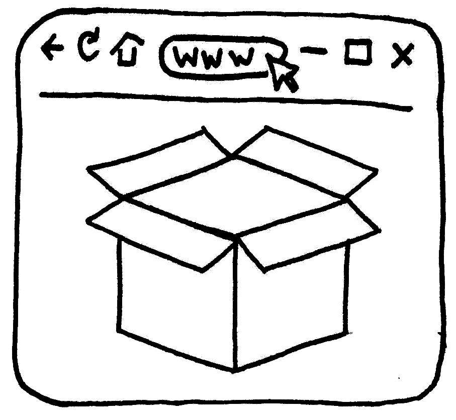

<p align="center">
  <a href="https://cims.carleton.ca/#/home">CIMS lab</a>
  |
  <a href=https://reposarch.vercel.app/arcn5005>REPOSARCH</a>
  |
  <a href=https://nicoarellano.github.io/reposarch/></a>
</p>


<h1>Open Source Architectural Representation Course</h1>

This is a [React.js](https://react.dev/) and [Next.js](https://nextjs.org/) project bootstrapped with [`npx create-next-app next-tailwind-typescript-starter`](https://github.com/vercel/next.js/tree/canary/packages/create-next-app).

## Getting Started

First, install the dependencies

```bash
npm install
# or
yarn install
```

Second, run the development server:

```bash
npm run dev
# or
yarn dev
```

Open [http://localhost:3000](http://localhost:3000) with your browser to see the result.

This project uses [`next/font`](https://nextjs.org/docs/basic-features/font-optimization) to automatically optimize and load Inter, a custom Google Font.

## Learn More

To learn more about Next.js, take a look at the following resources:

- [Next.js Documentation](https://nextjs.org/docs) - learn about Next.js features and API.
- [Learn Next.js](https://nextjs.org/learn) - an interactive Next.js tutorial.

You can check out [the Next.js GitHub repository](https://github.com/vercel/next.js/) - your feedback and contributions are welcome!

## Deploy on Vercel

The easiest way to deploy your Next.js app is to use the [Vercel Platform](https://vercel.com/new?utm_medium=default-template&filter=next.js&utm_source=create-next-app&utm_campaign=create-next-app-readme) from the creators of Next.js.

Check out our [Next.js deployment documentation](https://nextjs.org/docs/deployment) for more details.
